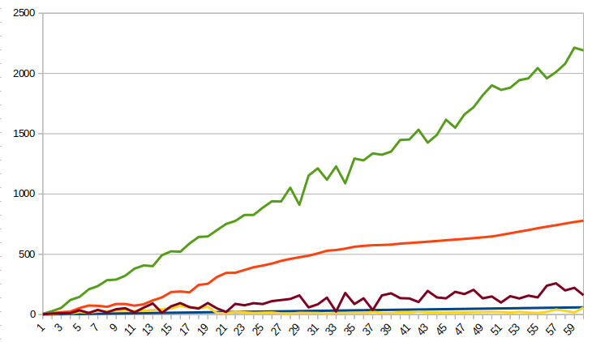

---
output:
  html_document: default
  pdf_document: default
---
# Lab 1 - Basic Concurrency in Java

- Group 18
- Simon Dussud and Wenqi Cao

## Task 1: Simple Synchronization

### A. Race Conditions

Source files:

- `task1/MainA.java` (main file)

To compile and execute:

```shell
javac MainA.java
java  Main
```

We are likely to observe inconsistent and unpredictable results due to non atomic operations.
Multiple threads attempt to read, increment, and write back to the shared counter without synchronization. So threads can read the old value simultaneously and increment it, causing missed increments.
We are likely to observe inconsistent and unpredictable results due to non atomic operations.
Multiple threads attempt to read, increment, and write back to the shared counter without synchronization. So threads can read the old value simultaneously and increment it, causing missed increments.

### B. Synchronized Keyword

Source files:

- `task1/MainB.java` (main file)

To compile and execute:

```shell
javac MainB.java
java  Main
```

The final value of sharedCounter should be exactly 4,000,000.
This is because the synchronized block ensures that only one thread can execute the critical section (the increment operation) at a time

### C. Synchronization Performance

Source files:

- `task1/MainC.java` (main file)

To compile and execute:

```shell
javac MainC.java
java  Main <N>
```

> Let's analyze the performance.

Description of the experimental machine (my local machine):

-   Processor: Intel(R) Core(TM) i7-9850H CPU 2.60GHz x86 64-bit, 6 cores
-   Memory: 15 GB
-   System: Linux, DELL Precision-7540

Sample of Y=100 times and X=100 warm-ups

In figure 1, we see how the execution time scaled with the number of threads:



## Task 2: Guarded Blocks using wait()/notify()

### A. Asynchronous Sender-Receiver

Source files:

- `task2/MainA.java` (main file)

To compile and execute:

```shell
javac MainA.java
java  Main
```

> Since the print thread runs in parallel with the increment thread without synchronization, it may print a value between 0 and 1,000,000.

### B. Busy-waiting Receiver

Source files:

- `task2/MainB.java` (main file)

To compile and execute:

```shell
javac MainB.java
java  Main
```

> With the while loop to continuously check if 'done' is true, the program works fine and print 1,000,000

### C. Waiting with Guarded Block

Source files:

- `task2/MainC.java` (main file)

To compile and execute:

```shell
javac MainC.java
java  Main
```

> This also works well.


### D. Guarded Block Performance

Source files:

- `task2/MainD.java` (main file)

To compile and execute:

```shell
javac MainD.java
java  Main
```

> Let's analyze the performance.

Description of the experimental machine:

-   Processor: Intel(R) Core(TM) i7-9850H CPU 2.60GHz x86 64-bit, 6 cores
-   Memory: 15 GB
-   System: Linux, DELL Precision-7540

Sample of Y=20,000 times and X=10,000 warm-ups

| Time (in ms)                  | Busy-waiting | Guarded Block |
| ----------------------------- | ------------ | ------------- |
| Average execution time        | 28.69 ms     | 28.73 ms      |
| Standart deviation exec time  | 16.14        | 15.99         |
| Average delay time            | 11.89 ms     | 11,94 ms      |
| Standart deviation delay time | 14.55        | 15.17         |


>The measurement of the waiting delay between the two processes or the execution time is extremely similar between the busy-waiting receiver and the guarded block. However, the guarded block should be significantly better in terms of CPU load and, consequently, energy consumption.

## Task 3: Producer-Consumer Buffer using Condition Variables


### A. Implementation

Source files:

- `task3/Buffer.java`

To compile and execute:

```shell
javac Buffer.java
```

> The condition variables ensure that producers wait when the buffer is full and consumers wait when it's empty, while maintaining thread safety with the ReentrantLock.

> The order of consumption is FIFO.

> The implementation ensures that the producer will not proceed to add an item after being awakened if the closure happens while it was waiting.

### B. Program using Buffer Class

Source files:

- `task3/Main.java` (main file)
- `task3/Buffer.java`

To compile and execute:

```shell
javac Main.java Buffer.java
java  Main
```

> This program ensures that the producer and consumer work concurrently on the shared buffer, with proper handling of the buffer's closure and thread termination.

## Task 4: Counting Semaphore

### A. Implementation

Source files:

- `task4/CountingSemaphore.java`

To compile and execute:

```shell
javac CountingSemaphore.java
```

> The semaphore’s count can be negative and does not have a minimum value constraint other than the practical constraint of how many threads can be waiting. The negative value represents the number of threads waiting for a resource, with count tracking the balance of available versus used resources.

> Handle spurious wake-ups by using a loop to recheck the condition after being awakened, ensuring that it only proceeds when the condition is truly met.

### B. Program using Counting Semaphore

Source files:

- `task4/Main.java` (main file)
- `task4/CountingSemaphore.java`

To compile and execute:

```shell
javac Main.java CountingSemaphore.java
java  Main
```

> The program demonstrates the use of the semaphore with a producer thread that signals the semaphore and a consumer thread that waits for the semaphore.

> The implementation provide options to adjust task durations of the producer and the consumer.

> When the producer's task duration is set to 1000ms and the consumer's task duration to 250ms, the consumers will operate faster than the producer. This setup naturally results in the consumers frequently waiting for the producer to generate new items, as they will quickly consume all available resources. This configuration is typical in a producer-consumer scenario, where consumers must occasionally wait for production to catch up.

## Task 5: Dining Philosophers

### A. Model the Dining Philosophers

Source files:

- `task5/MainA.java` (main file)

To compile and execute:

```shell
javac MainA.java
java  Main
```

> This implementation may lead to a deadlock situation because each philosopher attempts to acquire the left chopstick first, and then the right chopstick. If all philosophers pick up their left chopstick simultaneously, they will all wait indefinitely for the right chopstick, causing a deadlock.
> The more philosophers there are, the lower the probability of them getting blocked, because it would require all of them to request the lock at the same time.
> The Java ThreadMXBean interface appears to work well for automatically detecting deadlocks and identifying their causes.

### B. Solution Implementation

Source files:

- `task5/MainB.java` (main file)

To compile and execute:

```shell
javac MainB.java
java  Main
```

We implemented solution 3.
But we resolved this problem in three steps:

First Solution:

First, we considered a solution where each philosopher randomly chooses to pick up either their left or right chopstick first. Then, for the second chopstick, they wait for a certain timeout period. If the timeout expires, they release the first chopstick and return to the starting position, where they randomly decide again whether to pick up the left or right chopstick.
We believe this solution is both deadlock-free and starvation-free because the probability of finding a second chopstick is non-zero, and the philosopher retries each time.
However, we implemented the third solution, which is more concise.

Second Solution:

We manage a shared boolean array accessed by all the processes, indicating whether both chopsticks are simultaneously available or not.
This solution is somewhat cheating because it introduces a new shared resource among all processes.

Third Solution:

The second solution led us to the third solution. This solution uses the tryLock() method from the API (instead of lock()), which allows attempting to pick up chopsticks without blocking indefinitely.
If a philosopher fails to acquire both chopsticks, he releases any chopsticks he might have picked up and tries again later.
A deadlock occurs if all processes simultaneously acquire and release their chopsticks in a synchronized manner.
And this situation cannot persist indefinitely.
So this solution is Deadlock-free and Starvation-free
