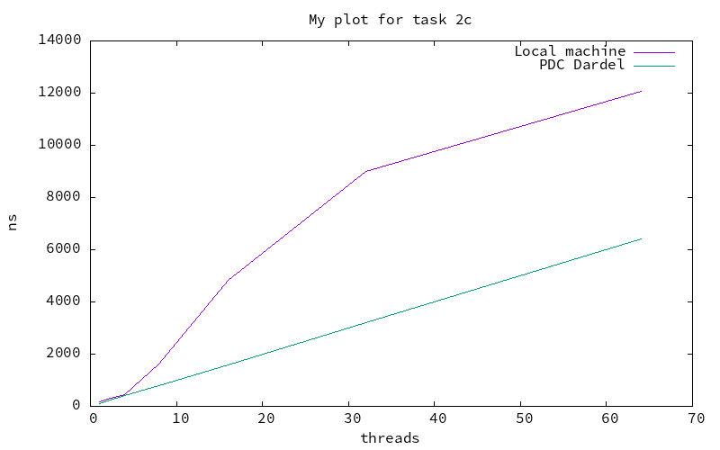

# Lab 1 - Basic Concurrency in Java
- Group 18
- Simon Dussud and Wenqi Cao

## Task 1: Simple Synchronization

### A. Race Conditions
Source files:
- `task1/MainA.java` (main file)

To compile and execute:
```shell
javac MainA.java
java  Main
```

### B. Synchronized Keyword
Source files:
- `task1/MainB.java` (main file)

To compile and execute:
```shell
javac MainB.java
java  Main
```

### C. Synchronization Performance
Source files:
- `task1/MainC.java` (main file)

To compile and execute:
```shell
javac MainC.java
java  Main <N>
```
> Where `N` is number of threads to execute with.

In figure 1, we see how the execution time scaled with the number of threads:



## Task 2: Guarded Blocks using wait()/notify()

### A. Asynchronous Sender-Receiver
Source files:
- `task2/MainA.java` (main file)

To compile and execute:
```shell
javac MainA.java
java  Main
```

> Since the print thread runs in parallel with the increment thread without synchronization, it may print a value between 0 and 1,000,000.

### B. Busy-waiting Receiver
Source files:
- `task2/MainB.java` (main file)

To compile and execute:
```shell
javac MainB.java
java  Main
```

> With the while loop to continuously check if 'done' is true, the program works fine and print 1,000,000

### C. Waiting with Guarded Block
Source files:
- `task2/MainC.java` (main file)

To compile and execute:
```shell
javac MainC.java
java  Main
```

> This also works well.
> Let's analyze the performance.

### D. Guarded Block Performance
Source files:
- `task2/MainD.java` (main file)

To compile and execute:
```shell
javac MainD.java
java  Main
```

## Task 3: Producer-Consumer Buffer using Condition Variables


### A. Implementation
Source files:
- `task3/Buffer.java`

To compile and execute:
```shell
javac Buffer.java
```

### B. Program using Buffer Class
Source files:
- `task3/Main.java` (main file)
- `task3/Buffer.java`

To compile and execute:
```shell
javac Main.java Buffer.java
java  Main
```

## Task 4: Counting Semaphore

### A. Implementation
Source files:
- `task4/CountingSemaphore.java`

To compile and execute:
```shell
javac CountingSemaphore.java
```

### B. Program using Counting Semaphore
Source files:
- `task4/Main.java` (main file)
- `task4/CountingSemaphore.java`

To compile and execute:
```shell
javac Main.java CountingSemaphore.java
java  Main
```

## Task 5: Dining Philosophers

### A. Model the Dining Philosophers
Source files:
- `task5/MainA.java` (main file)

To compile and execute:
```shell
javac MainA.java
java  Main
```

### B. Solution Implementation
Source files:
- `task5/MainB.java` (main file)

To compile and execute:
```shell
javac MainB.java
java  Main
```